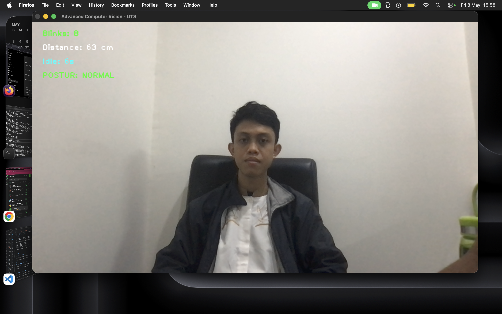
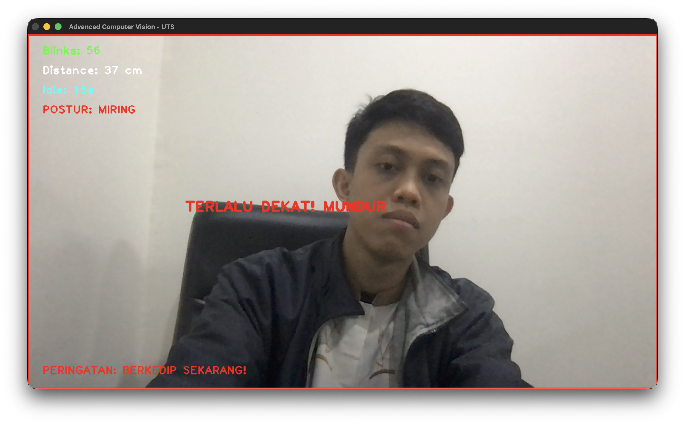

# AI-Driven CVS & Posture Monitor

### Real-Time Computer Vision System for Computer Vision Syndrome (CVS) Prevention

## Overview

AI-Driven CVS & Posture Monitor adalah sistem berbasis Computer Vision dan Deep Learning yang dirancang untuk membantu mendeteksi risiko **Computer Vision Syndrome (CVS)** secara real-time menggunakan webcam standar.

Sistem memanfaatkan model pretrained dari MediaPipe untuk melakukan analisis visual terhadap perilaku pengguna komputer, meliputi:

* Deteksi laju kedipan mata (*blink rate*)
* Estimasi jarak wajah ke layar monitor
* Analisis postur bahu
* Peringatan visual ergonomis secara real-time

Project ini dikembangkan sebagai implementasi mata kuliah **Advanced Computer Vision** pada Program Pascasarjana Teknik Informatika Universitas Pamulang.

---

# Full Research Report

Laporan penelitian lengkap dapat diakses melalui link berikut:

[View Full Research Report](https://docs.google.com/document/d/1PUmUg0opMD3qEety40Sjh8DKpqbVUSDB_2ww4GW-3eE/edit?usp=drive_link)

---

# Demo

## Normal Condition



Sistem berhasil mendeteksi kondisi pengguna dalam keadaan normal tanpa pelanggaran ambang batas ergonomis.

---

## Alert Condition



Sistem memberikan peringatan visual secara real-time ketika terdeteksi:

* Jarak wajah terlalu dekat dengan layar
* Pengguna terlalu lama tidak berkedip
* Postur tubuh tidak ergonomis

---

# Features

## 1. Real-Time Blink Detection

Menggunakan metode **Eye Aspect Ratio (EAR)** untuk mendeteksi aktivitas kedipan mata berdasarkan landmark wajah.

Sistem memberikan peringatan apabila pengguna terlalu lama tidak berkedip yang dapat memicu mata kering (*dry eye*).

---

## 2. Face-to-Screen Distance Estimation

Mengestimasi jarak wajah terhadap layar menggunakan landmark pipi dan pendekatan *pin-hole camera model*.

Sistem akan menampilkan peringatan apabila jarak pengguna terlalu dekat dengan layar monitor.

---

## 3. Ergonomic Posture Monitoring

Memantau keseimbangan posisi bahu menggunakan pose landmark dari MediaPipe Pose.

Sistem mendeteksi indikasi postur miring yang berpotensi menyebabkan ketegangan otot leher dan bahu.

---

## 4. Real-Time Visual Alerts

Memberikan overlay peringatan secara langsung pada frame video ketika kondisi berisiko terdeteksi.

Contoh peringatan:

* TERLALU DEKAT! MUNDUR
* PERINGATAN: BERKEDIP SEKARANG!
* POSTUR: MIRING

---

# AI & Deep Learning Components

Project ini memanfaatkan model Deep Learning pretrained dari MediaPipe, antara lain:

* BlazeFace
* Face Mesh
* BlazePose

Model digunakan untuk melakukan inferensi landmark wajah dan tubuh secara real-time tanpa memerlukan proses training tambahan.

Landmark yang dihasilkan kemudian dianalisis menggunakan pendekatan rule-based untuk mendeteksi perilaku pengguna.

---

# System Pipeline

```text
Webcam Input
      ↓
OpenCV Frame Processing
      ↓
MediaPipe Face Mesh & Pose
      ↓
Landmark Extraction
      ↓
Behavior Analysis
(EAR, Distance, Posture)
      ↓
Real-Time Alert System
```

---

# Technical Details

## Eye Aspect Ratio (EAR)

Sistem menghitung keterbukaan mata menggunakan rumus:

```text
EAR = (||p2 - p6|| + ||p3 - p5||) / (2 ||p1 - p4||)
```

Threshold:

* EAR < 0.23 → mata dianggap tertutup

---

## Distance Estimation

Estimasi jarak wajah dilakukan menggunakan rumus:

```text
Distance = (RealWidth × FocalLength) / PixelWidth
```

Threshold:

* Distance < 60 cm → peringatan terlalu dekat

---

## Idle Blink Monitoring

Jika pengguna tidak berkedip selama lebih dari 10 detik:

* Sistem akan memberikan peringatan mata kering

---

# Tech Stack

* Python 3
* OpenCV
* MediaPipe
* NumPy

---

# Installation

Clone repository:

```bash
git clone https://github.com/esarizki15/cvs-detection.git
cd cvs-detection
```

Buat virtual environment:

```bash
python3 -m venv venv
source venv/bin/activate
```

Install dependencies:

```bash
pip install opencv-python mediapipe numpy
```

---

# Running the Application

```bash
python app.py
```

Tekan tombol ESC untuk keluar dari aplikasi.

---

# Project Structure

```text
cvs-detection/
│
├── assets/
│   ├── normal.png
│   └── alert.png
│
├── app.py
├── requirements.txt
├── README.md
└── .gitignore
```

---

# Limitations

* Sensitif terhadap kondisi pencahayaan rendah
* Estimasi jarak dipengaruhi posisi kamera dan kalibrasi
* Threshold EAR dapat berbeda pada tiap individu
* Belum mendukung multi-user detection

---

# Future Improvements

* Audio alert
* Logging & analytics dashboard
* Web-based monitoring
* Adaptive threshold personalization
* CNN/LSTM-based fatigue prediction

---

# Research References

* MediaPipe Face Mesh
* MediaPipe Pose
* Eye Aspect Ratio (EAR)
* Computer Vision Syndrome (CVS)
* Ergonomic Monitoring

---

# Author

**Esa Rizki Hari Utama**
Master of Data Science Student
Universitas Pamulang

---

# License

This project is licensed under the MIT License.
